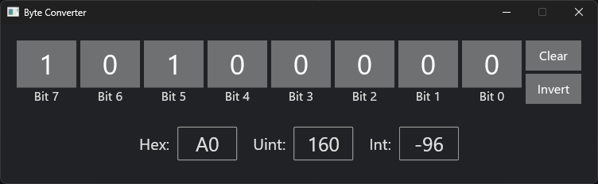

# Byte Converter

Simple tool for converting between hexadecimal, unsigned and signed representations of an 8-bit value.


## Running

```bash
cargo run --release
```


# Byte Converter



A simple tool for converting between hexadecimal, unsigned and signed representations of an 8-bit value.

## Features

- **Binary Representation**: Toggle individual bits of a byte.
- **Value Input**: Enter and view the byte value in hexadecimal, signed, and unsigned format.
- **Scroll Support**: Increment or decrement the byte value using the mouse scroll wheel.
- **Bitwise Operations**: Clear, invert, shift left, and shift right operations on the byte value.

## Installation

Ensure Rust is installed or install Rust from [rust-lang.org](https://www.rust-lang.org/).

Clone the repository:

```sh
git clone https://github.com/yourusername/byte-converter.git
cd byte-converter
```

Build the project:

```sh
cargo build --release
```

Run the project:

```sh
cargo run --release
```
